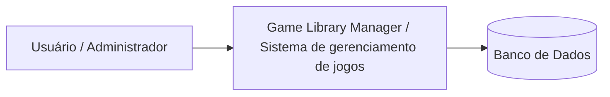
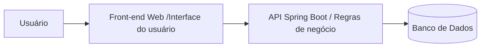
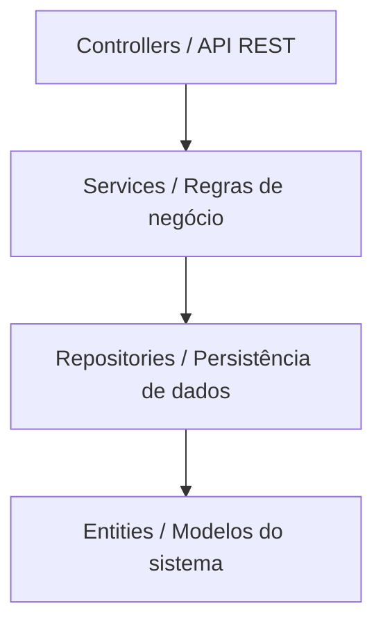

# Game-Library-Manager---Projeto-Academico
🎮 Game Library Manager – Aplicação Web

Descrição do Projeto

O Game Library Manager é uma aplicação web para gerenciamento de uma biblioteca de jogos físicos, permitindo o cadastro de usuários, jogos e o controle de empréstimos.

O sistema foi projetado seguindo uma arquitetura em camadas (Controller, Service, Repository, Model), utilizando princípios REST, separação de responsabilidades e boas práticas de desenvolvimento backend e frontend.

O objetivo do projeto é aplicar conceitos de:

Front-end / Client-side;

Back-end / Server-side;

REST;

Padrões de Projeto;

Controle de acesso com autenticação;

Testes automatizados;

Deploy e CI/CD;

Observabilidade.

Arquitetura - Monolítica em Camadas

O sistema será estruturado em:
Controller → Service → Repository → Banco de Dados

Camadas:
Controller → Exposição de endpoints REST
Service → Regras de negócio
Repository → Acesso a dados
Model/Entity → Representação das entidades do sistema

Funcionalidades - CRUD Principal

CRUD completo de Jogos:
Criar jogo
Listar jogos
Atualizar jogo
Remover jogo

Controle de Acesso

O sistema contará com:
Endpoint de login
Geração de token JWT
Proteção de rotas autenticadas
Controle de acesso baseado em token

Front-end
Interface simples para:
Cadastro de jogos
Cadastro de usuários
Realização de empréstimos
Listagem de histórico

Tecnologias possíveis:
HTML + CSS + JavaScript
Comunicação via API REST.

Banco de Dados
Inicialmente:
H2 (ambiente de desenvolvimento)
Possível produção:
PostgreSQL

Testes
Testes unitários na camada Service
Validação de regras de negócio
Testes de endpoints principais

CI/CD

Repositório GitHub
Pipeline automático para:
Build
Testes
Deploy

Observabilidade
Logs estruturados
Monitoramento básico de erros
Possível integração futura com ferramenta de monitoramento

-----------------------------------------------------------
# Interação 2 - Resultado da Implementação Inicial
Na Interação 1 foi definido o escopo do projeto e a estratégia inicial de desenvolvimento.

Foi decidido iniciar a implementação pelo Back-end, com foco na modelagem do domínio, estrutura de persistência e implementação das regras de negócio.

Nesta Interação 2, o repositório já contém a implementação inicial da camada de domínio e da lógica de negócio do sistema.

### Artefatos implementados no repositório:

#### A estrutura atual do projeto contém:
* Modelagem do domínio
* Usuario
* Jogo
* Emprestimo

#### Persistência de dados: 
* UsuarioRepository
* JogoRepository
* EmprestimoRepository

#### Regras de negócio: 
* UsuarioService 
* JogoService
* EmprestimoService
 
 
### Arquitetura do Sistema

O sistema foi estruturado utilizando arquitetura em camadas, separando responsabilidades entre os componentes da aplicação. 

### Camadas da aplicação:

* Controller - interface da API;

* Service - regras de negócio;

* Repository - acesso a dados;

* Entity - representação das tabelas do banco

### Requisitos do Sistema
Requisitos Funcionais

Os requisitos funcionais descrevem as funcionalidades que o sistema deve oferecer.

#### RF01 — Cadastro de usuários

* O sistema deve permitir o cadastro de usuários que poderão realizar empréstimos de jogos.

#### RF02 — Cadastro de jogos

* O sistema deve permitir o cadastro de jogos na biblioteca.

Cada jogo deve possuir ao menos:

* nome

* gênero

* status de disponibilidade

#### RF03 — Consulta de usuários

* O sistema deve permitir consultar os usuários cadastrados.

#### RF04 — Consulta de jogos

* O sistema deve permitir consultar os jogos cadastrados na biblioteca.

#### RF05 — Registro de empréstimo

* O sistema deve permitir registrar o empréstimo de um jogo para um usuário.

#### Regras:

* o usuário deve existir

* o jogo deve existir

* o jogo deve estar disponível

#### RF06 — Registro de devolução

* O sistema deve permitir registrar a devolução de um jogo.
Ao registrar a devolução:
* o empréstimo é finalizado
* o jogo volta a ficar disponível

#### RF07 — Controle de disponibilidade

* O sistema deve controlar automaticamente a disponibilidade dos jogos.
* jogos emprestados ficam indisponíveis
* após devolução ficam disponíveis novamente

### Requisitos Não Funcionais

Os requisitos não funcionais descrevem características de qualidade do sistema.

#### RNF01 — Arquitetura em camadas

O sistema deve utilizar arquitetura em camadas separando:

* Controller
* Service
* Repository
* Model

#### RNF02 — Persistência de dados

* Os dados devem ser persistidos utilizando banco de dados relacional através do Spring Data JPA.

#### RNF03 — Organização do código

* O código deve seguir boas práticas de organização e separação de responsabilidades.

#### RNF04 — Controle de versão

* O projeto deve utilizar Git para controle de versão e hospedagem no GitHub.

#### RNF05 — Escalabilidade

* A arquitetura do sistema deve permitir a futura implementação de:

* autenticação de usuários

* interface web

* testes automatizados
 
### Ajuste de Requisitos

Durante a implementação inicial foram identificadas algumas regras necessárias para o funcionamento correto do sistema.

Regras definidas

* Um jogo só pode ser emprestado se estiver disponível.

* Um jogo não pode possuir mais de um empréstimo ativo ao mesmo tempo.

* Para registrar um empréstimo:

* O usuário deve existir

* o jogo deve existir

* Ao registrar uma devolução:

* O empréstimo é finalizado

* O jogo volta a ficar disponível

### Arquitetura - Modelo C4

Os níveis utilizados foram: 
* Contexto
* Contêineres
* Componentes

#### Nível 1 - Diagrama de Contexto

Mostra o sistema como um todo e sua interação com os usuários.

Observações:
* Usuários interagem com o sistema
* O sistema gerencia os dados
* As informações são persistidas no banco de dados

#### Nível 2 - Diagrama de Contêineres

Mostra os principais blocos que compõem a solução.

#### Front-end:

Interface utilizada pelos usuários para interagir com o sistema.

#### Back-end:

API responsável por:

* regras de negócio

* controle de empréstimos

* gerenciamento de usuários e jogos

* Banco de dados

#### Armazena:

* usuários

* jogos

* empréstimos

#### Nível 3 - Diagrama de Componentes

Mostra a estrutura interna da API.

#### Controllers:

Responsáveis por expor os endpoints da aplicação.

#### Services:

Contêm a lógica de negócio do sistema.

#### Repositories:

Responsáveis pelo acesso ao banco de dados utilizando Spring Data JPA.

#### Entities:

Representam as tabelas do banco e os modelos do domínio.

Conclusão
O projeto busca integrar conceitos teóricos e práticos da disciplina de Programação Web, aplicando padrões de projeto, arquitetura organizada e boas práticas de desenvolvimento, resultando em uma aplicação funcional, testável e implantada em produção.
