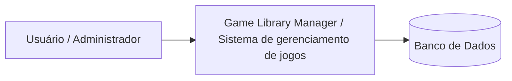
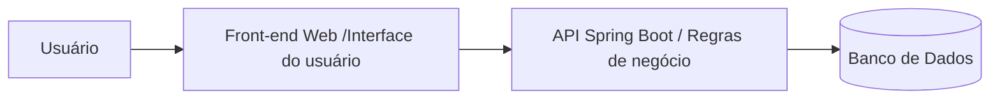
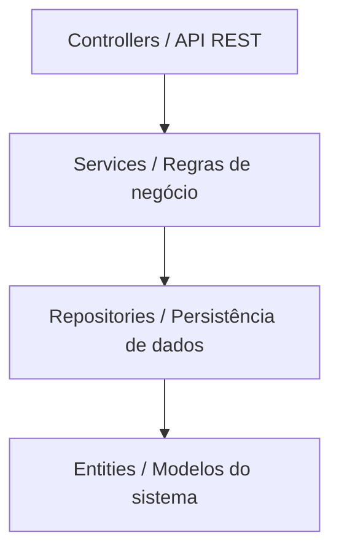

# Game-Library 
Projeto-Academico
-----------------------------------------------------------
Descrição do Projeto

O Game Library Manager é uma aplicação web para gerenciamento de uma biblioteca de jogos físicos, permitindo o cadastro de usuários, jogos e o controle de empréstimos.

O sistema foi projetado seguindo uma arquitetura em camadas (Modelo MVC), utilizando princípios REST, separação de responsabilidades e boas práticas de desenvolvimento backend e frontend.

### Requisitos do Sistema
Requisitos Funcionais

Os requisitos funcionais descrevem as funcionalidades que o sistema deve oferecer.

#### RF01 — Cadastro de usuários

* O sistema deve permitir o cadastro de usuários que poderão realizar empréstimos de jogos.

#### RF02 — Cadastro de jogos

* O sistema deve permitir o cadastro de jogos na biblioteca.

Cada jogo deve possuir ao menos:

* nome

* gênero

* status de disponibilidade

#### RF03 — Consulta de usuários

* O sistema deve permitir consultar os usuários cadastrados.

#### RF04 — Consulta de jogos

* O sistema deve permitir consultar os jogos cadastrados na biblioteca.

#### RF05 — Registro de empréstimo

* O sistema deve permitir registrar o empréstimo de um jogo para um usuário.

#### Regras:

* o usuário deve existir

* o jogo deve existir

* o jogo deve estar disponível

#### RF06 — Registro de devolução

* O sistema deve permitir registrar a devolução de um jogo.
Ao registrar a devolução:
* o empréstimo é finalizado
* o jogo volta a ficar disponível

#### RF07 — Controle de disponibilidade

* O sistema deve controlar automaticamente a disponibilidade dos jogos.
* jogos emprestados ficam indisponíveis
* após devolução ficam disponíveis novamente

### Requisitos Não Funcionais

Os requisitos não funcionais descrevem características de qualidade do sistema.

#### RNF01 — Arquitetura em camadas

O sistema deve utilizar arquitetura em camadas separando:

* Controller
* Service
* Repository
* Model

#### RNF02 — Persistência de dados

* Os dados devem ser persistidos utilizando banco de dados relacional através do Spring Data JPA.

#### RNF03 — Organização do código

* O código deve seguir boas práticas de organização e separação de responsabilidades.

#### RNF04 — Controle de versão

* O projeto deve utilizar Git para controle de versão e hospedagem no GitHub.

#### RNF05 — Escalabilidade

* A arquitetura do sistema deve permitir a futura implementação de:

* autenticação de usuários

* interface web

* testes automatizados
 
### Ajuste de Requisitos

Durante a implementação inicial foram identificadas algumas regras necessárias para o funcionamento correto do sistema.

Regras definidas

* Um jogo só pode ser emprestado se estiver disponível.

* Um jogo não pode possuir mais de um empréstimo ativo ao mesmo tempo.

* Para registrar um empréstimo:

* O usuário deve existir

* o jogo deve existir

* Ao registrar uma devolução:

* O empréstimo é finalizado

* O jogo volta a ficar disponível

#Fluxo do Sistema

1. Administrador realiza login

2. Administrador cadastra novos jogos

3. Usuário realiza cadastro

4. Usuário faz login
   
5. Sistema redireciona para o painel principal
   
6. Usuário visualiza os jogos disponíveis
   
7. Usuário seleciona um jogo
    
8. Usuário solicita o aluguel por um período de tempo
    
9. Sistema verifica a disponibilidade do jogo
    
10. Sistema registra o empréstimo
    
11. Sistema marca o jogo como indisponível
    
12. Usuário pode visualizar seus jogos alugados
    
13. Usuário devolve o jogo
    
14. Sistema finaliza o empréstimo
    
15. Sistema marca o jogo como disponível novamente
-----------------------------------------------------------

#Tecnologias

# Back-end: Java com Spring Boot (Framework)

O Spring Boot facilita a criação de APIs REST de forma organizada;
Permite separar o projeto em camadas (Controller, Service e Repository);
Possui integração simples com JPA/Hibernate para persistência de dados;
Oferece suporte nativo à autenticação com JWT;
Reduz configuração inicial e acelera o desenvolvimento;
Amplamente utilizado no mercado corporativo Java;
Adequado para projetos acadêmicos por sua organização e boas práticas.
-----------------------------------------------------------
# Front-end: HTML + CSS + JavaScript com React (Framework)

Permite criação de interface web interativa e dinâmica;
Componentização facilita reutilização de código;
Separação clara entre interface e regras do sistema;
Integração simples com API REST do backend;
Facilita criação de telas como login, listagem e empréstimos;
Amplamente utilizado no mercado de desenvolvimento web;
Adequado para aplicações SPA (Single Page Application).
-----------------------------------------------------------
# Banco de Dados : H2 (Desenvolvimento) e PostgreSQL (Produção)

H2 permite execução em memória sem necessidade de instalação;
Facilita testes e desenvolvimento rápido;
Integração nativa com Spring Boot;
PostgreSQL é um banco relacional robusto e confiável;
Suporte a relacionamentos entre entidades (usuário, jogos e empréstimos);
Permite uso de chaves primárias e estrangeiras garantindo integridade dos dados;
Amplamente utilizado em ambientes profissionais e acadêmicos.
-----------------------------------------------------------
# Testes:

Testes unitários na camada Service para validação das regras de negócio;
Garantem funcionamento correto do fluxo de empréstimos e devoluções;
Permitem validar disponibilidade dos jogos;
Facilitam manutenção e refatoração do código;
Testes dos principais endpoints da API REST;
Auxiliam na prevenção de regressões durante evolução do sistema.
-----------------------------------------------------------
## CI/CD:

Repositório hospedado no GitHub para versionamento do código;
Pipeline automático para build da aplicação;
Execução automática dos testes unitários;
Validação do projeto a cada commit ou pull request;
Possibilidade de deploy automatizado;
Garante maior confiabilidade e qualidade do sistema.
-----------------------------------------------------------
## O sistema contará com: 

Endpoint de autenticação para login de usuários;
Geração de token JWT para controle de sessão;
Proteção de rotas que exigem autenticação;
Controle de acesso baseado em token;
Separação de permissões entre administrador e usuário;
Validação de requisições autenticadas.
-----------------------------------------------------------
## Observabilidade:

Logs estruturados para acompanhamento da aplicação;
Registro de erros e exceções do sistema;
Monitoramento básico das operações da API;
Facilita identificação de falhas durante execução;
Possibilidade de integração futura com ferramentas de monitoramento;
Auxilia na manutenção e evolução do sistema.

-----------------------------------------------------------
 
## Arquitetura do Sistema

O sistema foi estruturado utilizando arquitetura em camadas, separando responsabilidades entre os componentes da aplicação. 

### Camadas da aplicação:

* Controller - interface da API;

* Service - regras de negócio;

* Repository - acesso a dados;

* Entity - representação das tabelas do banco

### Arquitetura - Modelo C4

Os níveis utilizados foram: 
* Contexto
* Contêineres
* Componentes

#### Nível 1 - Diagrama de Contexto

Mostra o sistema como um todo e sua interação com os usuários.

Observações:
* Usuários interagem com o sistema
* O sistema gerencia os dados
* As informações são persistidas no banco de dados

#### Nível 2 - Diagrama de Contêineres

Mostra os principais blocos que compõem a solução.

#### Front-end:

Interface utilizada pelos usuários para interagir com o sistema.

#### Back-end:

API responsável por:

* regras de negócio

* controle de empréstimos

* gerenciamento de usuários e jogos

* Banco de dados

#### Armazena:

* usuários

* jogos

* empréstimos

#### Nível 3 - Diagrama de Componentes

Mostra a estrutura interna da API.

#### Controllers:

Responsáveis por expor os endpoints da aplicação.

#### Services:

Contêm a lógica de negócio do sistema.

#### Repositories:

Responsáveis pelo acesso ao banco de dados utilizando Spring Data JPA.

#### Entities:

Representam as tabelas do banco e os modelos do domínio.

### Figma:
* https://www.figma.com/design/suO1FpLmPP80FqrqljXjy7/Locadora-de-jogos?node-id=0-1&m=dev&t=RgO8oIJZlXgeKHd8-1

Conclusão
O projeto busca integrar conceitos teóricos e práticos da disciplina de Programação Web, aplicando padrões de projeto, arquitetura organizada e boas práticas de desenvolvimento, resultando em uma aplicação funcional, testável e implantada em produção.
