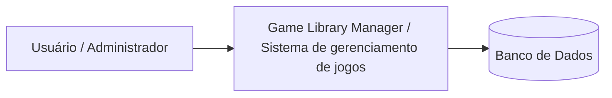
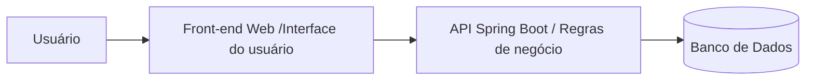
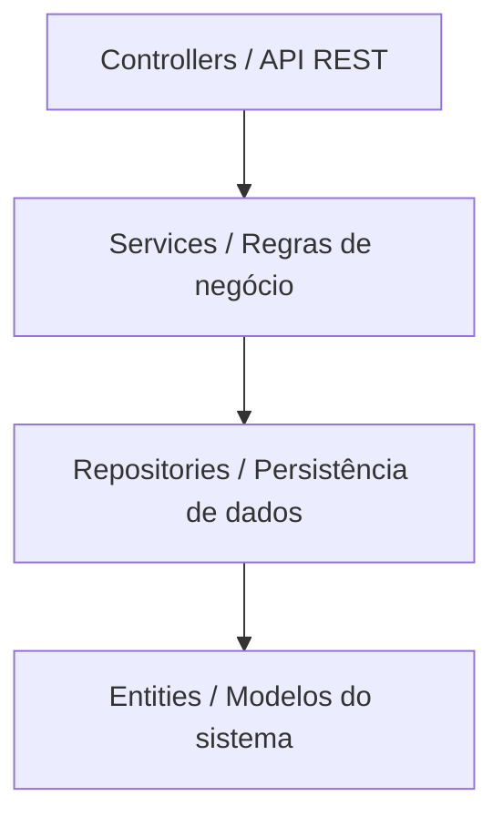

# Game-Library — Projeto-Academico
-----------------------------------------------------------
# Descrição do Projeto

O Game Library Manager é um sistema web desenvolvido para o gerenciamento de uma locadora de jogos. A aplicação permite o cadastro e autenticação de usuários, visualização dos jogos disponíveis e solicitação de empréstimos por um período determinado. O administrador é responsável pelo cadastro de novos jogos, enquanto o sistema realiza o controle automático da disponibilidade e do histórico das locações.

O projeto foi desenvolvido com arquitetura em camadas e API REST no back-end, além de uma interface web no front-end, visando organização do código, facilidade de manutenção e aplicação de boas práticas de desenvolvimento.

-----------------------------------------------------------

# Requisitos Funcionais

Os requisitos funcionais descrevem as funcionalidades que o sistema deve oferecer.

* RF01 — O sistema deve permitir o cadastro de usuários.

* RF02 — O sistema deve permitir autenticação de usuários por login e senha.

* RF03 — O sistema deve gerar um token JWT após autenticação válida.

* RF04 — O sistema deve proteger rotas que exigem autenticação.

* RF05 — O sistema deve permitir diferenciar permissões entre administrador e usuário.

* RF06 — O sistema deve permitir o cadastro de jogos pelo administrador.
  
Cada jogo deve possuir ao menos: nome, gênero e status de disponibilidade.

* RF07 — O sistema deve permitir a consulta dos jogos cadastrados.

* RF08 — O sistema deve permitir a consulta apenas dos jogos disponíveis para empréstimo.

* RF09 — O sistema deve permitir consultar os usuários cadastrados.

* RF10 — O sistema deve permitir registrar o empréstimo de um jogo para um usuário.

Regras: o usuário deve existir, o jogo deve existir e o jogo deve estar disponível.

* RF11 — O sistema deve permitir informar o período do empréstimo.

* RF12 — O sistema deve registrar a data de início do empréstimo.

* RF13 — O sistema deve registrar a data prevista de devolução.

* RF14 — O sistema deve permitir registrar a devolução de um jogo.

* RF15 — Ao registrar a devolução, o empréstimo deve ser finalizado automaticamente.

* RF16 — Ao registrar a devolução, o jogo deve voltar a ficar disponível.

* RF17 — O sistema deve controlar automaticamente a disponibilidade dos jogos.

* RF18 — O sistema deve impedir o empréstimo de jogos indisponíveis.

* RF19 — O sistema deve permitir visualizar o histórico de empréstimos.

* RF20 — O sistema deve permitir consultar os empréstimos de um usuário específico.

* RF21 — O sistema deve permitir listar empréstimos ativos.

* RF22 — O sistema deve permitir listar empréstimos finalizados.

* RF23 — O sistema deve permitir que usuários visualizem seus jogos alugados.

* RF24 — O sistema deve validar a existência do usuário antes de registrar empréstimo.

* RF25 — O sistema deve validar a existência do jogo antes de registrar empréstimo.

* RF26 — O sistema deve retornar mensagens de erro para operações inválidas.

* RF27 — O sistema deve permitir consulta do status de disponibilidade dos jogos.

* RF28 — O sistema deve manter o histórico de empréstimos mesmo após devolução.

-----------------------------------------------------------
# Requisitos Não Funcionais

Os requisitos não funcionais descrevem características de qualidade do sistema.

* RNF01 — O sistema deve utilizar arquitetura em camadas (Controller, Service, Repository e Entity).

* RNF02 — O sistema deve disponibilizar API REST para comunicação entre front-end e back-end.

* RNF03 — O sistema deve utilizar Java com Spring Boot no back-end.

* RNF04 — O sistema deve utilizar Spring Data JPA para persistência de dados.

* RNF05 — O sistema deve utilizar banco de dados relacional.

* RNF06 — O sistema deve utilizar H2 em ambiente de desenvolvimento.

* RNF07 — O sistema deve permitir futura utilização do PostgreSQL em produção.

* RNF08 — O sistema deve retornar dados no formato JSON.

* RNF09 — O sistema deve implementar autenticação baseada em JWT.

* RNF10 — O sistema deve proteger rotas que exigem autenticação.

* RNF11 — O sistema deve validar token nas requisições protegidas.

* RNF12 — O sistema deve permitir controle de acesso baseado em autenticação.

* RNF13 — O sistema deve possuir tratamento global de exceções.

* RNF14 — O sistema deve retornar códigos HTTP apropriados.

* RNF15 — O sistema deve registrar logs das operações principais.

* RNF16 — O sistema deve registrar logs de erro.

* RNF17 — O sistema deve seguir boas práticas de organização de código.

* RNF18 — O sistema deve separar responsabilidades entre camadas.

* RNF19 — O sistema deve permitir testes unitários na camada Service.

* RNF20 — O sistema deve permitir testes dos endpoints principais.

* RNF21 — O sistema deve utilizar Git para controle de versão.

* RNF22 — O projeto deve ser hospedado em repositório GitHub.

* RNF23 — O sistema deve permitir execução em ambiente local.

* RNF24 — O sistema deve permitir futura integração com interface web React.

* RNF25 — O sistema deve permitir expansão futura da arquitetura.
* 
-----------------------------------------------------------
# Fluxo do Sistema

1. Administrador realiza login

2. Administrador cadastra novos jogos

3. Usuário realiza cadastro

4. Usuário faz login
   
5. Sistema redireciona para o painel principal
   
6. Usuário visualiza os jogos disponíveis
   
7. Usuário seleciona um jogo
    
8. Usuário solicita o aluguel por um período de tempo
    
9. Sistema verifica a disponibilidade do jogo
    
10. Sistema registra o empréstimo
    
11. Sistema marca o jogo como indisponível
    
12. Usuário pode visualizar seus jogos alugados
    
13. Usuário devolve o jogo
    
14. Sistema finaliza o empréstimo
    
15. Sistema marca o jogo como disponível novamente

-----------------------------------------------------------

#Tecnologias

# Back-end: Java com Spring Boot (Framework)

O Spring Boot facilita a criação de APIs REST de forma organizada;

Permite separar o projeto em camadas (Controller, Service e Repository);

Possui integração simples com JPA/Hibernate para persistência de dados;

Oferece suporte nativo à autenticação com JWT;

Reduz configuração inicial e acelera o desenvolvimento;

Amplamente utilizado no mercado corporativo Java;

Adequado para projetos acadêmicos por sua organização e boas práticas.

-----------------------------------------------------------
# Front-end: HTML + CSS + JavaScript com React (Framework)

Permite criação de interface web interativa e dinâmica;

Componentização facilita reutilização de código;

Separação clara entre interface e regras do sistema;

Integração simples com API REST do backend;

Facilita criação de telas como login, listagem e empréstimos;

Amplamente utilizado no mercado de desenvolvimento web;

Adequado para aplicações SPA (Single Page Application).

-----------------------------------------------------------
# Banco de Dados : H2 (Desenvolvimento) e PostgreSQL (Produção)

H2 permite execução em memória sem necessidade de instalação;

Facilita testes e desenvolvimento rápido;

Integração nativa com Spring Boot;

PostgreSQL é um banco relacional robusto e confiável;

Suporte a relacionamentos entre entidades (usuário, jogos e empréstimos);

Permite uso de chaves primárias e estrangeiras garantindo integridade dos dados;

Amplamente utilizado em ambientes profissionais e acadêmicos.

-----------------------------------------------------------
# Testes:

Testes unitários na camada Service para validação das regras de negócio;

Garantem funcionamento correto do fluxo de empréstimos e devoluções;

Permitem validar disponibilidade dos jogos;

Facilitam manutenção e refatoração do código;

Testes dos principais endpoints da API REST;

Auxiliam na prevenção de regressões durante evolução do sistema.

-----------------------------------------------------------
# CI/CD:

Repositório hospedado no GitHub para versionamento do código;

Pipeline automático para build da aplicação;

Execução automática dos testes unitários;

Validação do projeto a cada commit ou pull request;

Possibilidade de deploy automatizado;

Garante maior confiabilidade e qualidade do sistema.

-----------------------------------------------------------
# O sistema contará com: 

Endpoint de autenticação para login de usuários;

Geração de token JWT para controle de sessão;

Proteção de rotas que exigem autenticação;

Controle de acesso baseado em token;

Separação de permissões entre administrador e usuário;

Validação de requisições autenticadas.

-----------------------------------------------------------
# Observabilidade:

Logs estruturados para acompanhamento da aplicação;

Registro de erros e exceções do sistema;

Monitoramento básico das operações da API;

Facilita identificação de falhas durante execução;

Possibilidade de integração futura com ferramentas de monitoramento;

Auxilia na manutenção e evolução do sistema.

-----------------------------------------------------------
 
# Arquitetura do Sistema

O sistema foi estruturado utilizando arquitetura em camadas, separando responsabilidades entre os componentes da aplicação. 

### Camadas da aplicação:

* Controller - interface da API;

* Service - regras de negócio;

* Repository - acesso a dados;

* Entity - representação das tabelas do banco

### Arquitetura - Modelo C4

Os níveis utilizados foram: 
* Contexto
* Contêineres
* Componentes

#### Nível 1 - Diagrama de Contexto

Mostra o sistema como um todo e sua interação com os usuários.

Observações:
* Usuários interagem com o sistema
* O sistema gerencia os dados
* As informações são persistidas no banco de dados

#### Nível 2 - Diagrama de Contêineres

Mostra os principais blocos que compõem a solução.

#### Front-end:

Interface utilizada pelos usuários para interagir com o sistema.

#### Back-end:

API responsável por:

* regras de negócio

* controle de empréstimos

* gerenciamento de usuários e jogos

* Banco de dados

#### Armazena:

* usuários

* jogos

* empréstimos

#### Nível 3 - Diagrama de Componentes

Mostra a estrutura interna da API.

#### Controllers:

Responsáveis por expor os endpoints da aplicação.

#### Services:

Contêm a lógica de negócio do sistema.

#### Repositories:

Responsáveis pelo acesso ao banco de dados utilizando Spring Data JPA.

#### Entities:

Representam as tabelas do banco e os modelos do domínio.

### Figma:
* https://www.figma.com/design/suO1FpLmPP80FqrqljXjy7/Locadora-de-jogos?node-id=0-1&m=dev&t=RgO8oIJZlXgeKHd8-1

Conclusão
O projeto busca integrar conceitos teóricos e práticos da disciplina de Programação Web, aplicando padrões de projeto, arquitetura organizada e boas práticas de desenvolvimento, resultando em uma aplicação funcional, testável e implantada em produção.
